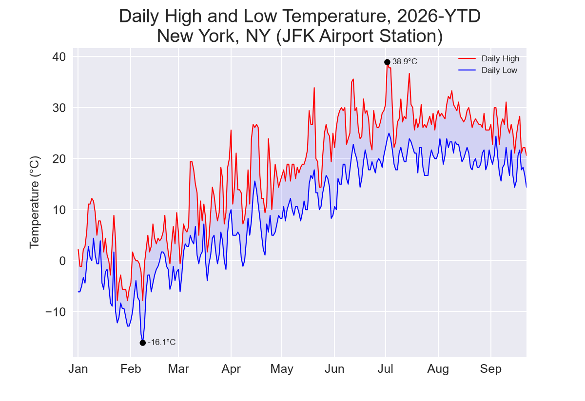
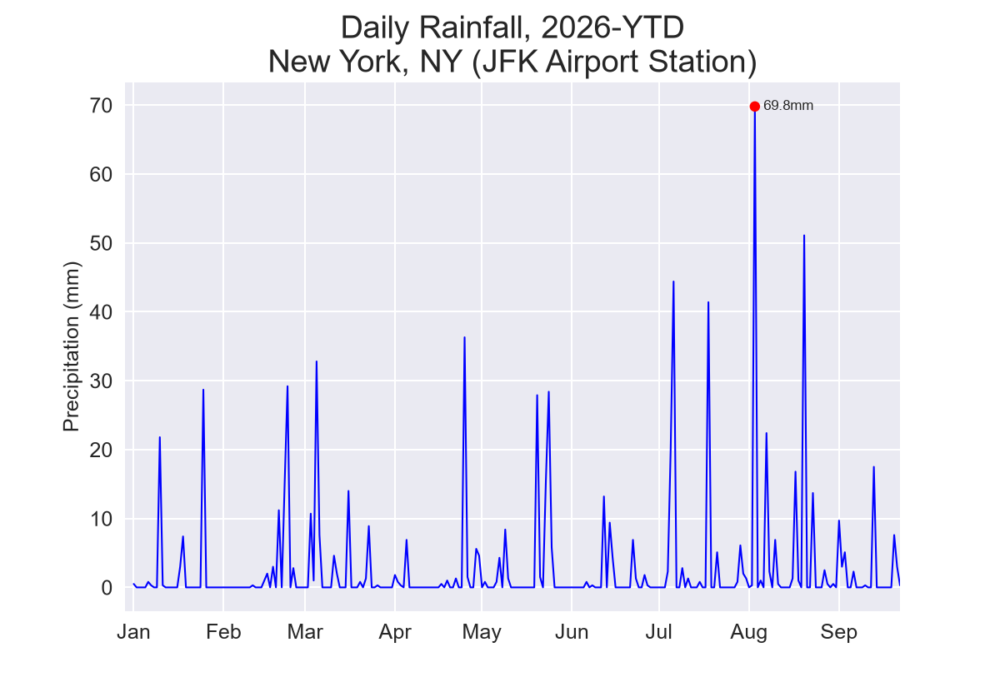
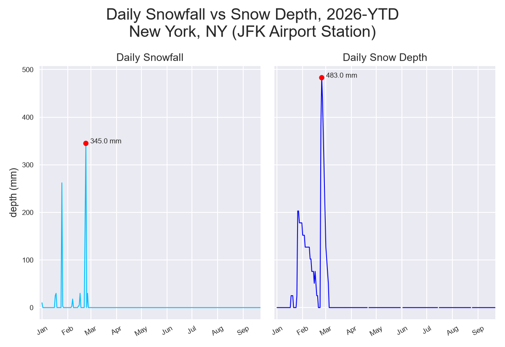

# NOAA Climate Data Analysis with Python

## Overview
This project explores how to work with the **NOAA Climate Data Online API** using **Python**. I retrieve daily climate observations, transform the API response with **Pandas**, and create visualizations with **Matplotlib**.

## What I Explored
- Making **API requests** with Python using `requests`
- Working with **API parameters** and authentication
- Handling **JSON responses**
- Using `limit` and `offset` to retrieve **paginated data**
- Transforming API data with **Pandas**
- Creating visualizations with **Matplotlib**

## Data
The data comes from the **NOAA Climate Data Online API**, using the **GHCND Daily Summaries** dataset.

- **Station:** JFK International Airport, New York
- **Period:** 2026 YTD
- **Dataset:** GHCND
- **Variables:** PRCP, SNOW, SNWD, TMAX, TMIN
- **Units:** Metric

[NOAA Climate Data Online API Documentation](https://www.ncei.noaa.gov/cdo-web/webservices/v2) provides the reference for the API endpoints, request parameters, authentication, available datasets, and response structure used in this project.

## Process

```text
NOAA Climate Data Online API
     ↓
JSON Response
     ↓
Pandas DataFrame
     ↓
Clean & Transform
     ↓
Matplotlib
     ↓
Visualizations
```

The project follows a simple workflow from retrieving API data to creating visualizations:

1. **Extract** daily observations from the NOAA API using `requests`
2. **Parse** the JSON response using `.json()`
3. **Transform** the response into a Pandas DataFrame
4. **Clean and reshape** the data for analysis
5. **Visualize** the results with Matplotlib

## Code

The main workflow is organized into three stages: **retrieving the data** from the NOAA API, **transforming it with Pandas**, and **creating visualizations** with Matplotlib.

### Libraries

The project uses the following Python libraries:

```python
import requests
import pandas as pd
import matplotlib.pyplot as plt
import matplotlib.dates as mdates
from datetime import date
```

* **Requests** for making API requests
* **Pandas** for data transformation and cleaning
* **Matplotlib** for data visualization
* **datetime** for working with dates


### 1. Fetching API Data

The API request uses **query parameters** to specify the dataset, station, variables, date range, and units.

```python
url = "https://www.ncei.noaa.gov/cdo-web/api/v2/data"

headers = {"token": "YOUR_TOKEN"}

params = {
    "datasetid": "GHCND",
    "stationid": "GHCND:USW00094789",
    "datatypeid": "PRCP,SNOW,SNWD,TAVG,TMAX,TMIN",
    "startdate": "2026-01-01",
    "enddate": date.today().isoformat(),
    "units": "metric",
    "limit": 1000
}

response = requests.get(url, params=params, headers=headers)
response_dicts = response.json()
response_dict = response_dicts['results']
```

This request retrieves daily observations from the **GHCND dataset** for the **JFK Airport station**. The response is returned as JSON, which can then be processed in Python.

### 2. Handling Pagination

The API limits the number of records returned `limit: 1000` in a single request, so a second request is made using the `offset` parameter start from `1001`.

```python
params['offset'] = 1001

r2 = requests.get(url, params=params, headers=headers)
response_dicts_2 = r2.json()
response_dict_2 = response_dicts_2['results']

response_dict = response_dict + response_dict_2
```

The results from both requests are **combined into a single list** before being converted into a DataFrame.

### 3. Transforming the Data

The combined JSON results are loaded into a **Pandas DataFrame**.

```python
df = pd.DataFrame(response_dict)

df['date'] = pd.to_datetime(df['date'])
```

The `date` column is converted from a string into **datetime format** so it can be used for time-based analysis and visualization.

### 4. Cleaning and Reshaping

Before making further changes, a **copy of the original DataFrame** is created. This keeps `df` available as the original transformed API data while `df_clean` is used for cleaning and reshaping.

```python
df_clean = df.copy()
```

The unnecessary columns are then removed, and the observations are pivoted from **long format to wide format**.

```python
df_clean = df_clean.drop(columns=['station', 'attributes'])

df_clean = df_clean.pivot(
    columns='datatype',
    index='date',
    values='value'
).reset_index()
```

This produces one row per date, with separate columns for variables such as `PRCP`, `SNOW`, `SNWD`, `TMAX`, and `TMIN`.

### Full Code

The complete Python script, including the **API requests, data transformation, cleaning, and visualizations**, is available here:

[`weather_analysis.py`](weather_analysis.py)

The Jupyter Notebook version of the project, including the **code, outputs, and visualizations**, is available here:

[`weather_analysis.ipynb`](weather_analysis.ipynb)

## Visualizations

The cleaned climate data was visualized with **Matplotlib** to show daily temperature, rainfall, snowfall, and snow depth throughout 2026 YTD.

### Daily High and Low Temperature

This chart shows the daily **maximum and minimum temperatures** recorded at JFK Airport.



```python
# Daily High vs Low Temperature
plt.style.use('seaborn-v0_8')

fig, ax = plt.subplots()
ax.plot(df_clean['date'], df_clean['TMAX'], color='red', linewidth=1)
ax.plot(df_clean['date'], df_clean['TMIN'], color='blue', linewidth=1)

ax.fill_between(df_clean['date'], df_clean['TMAX'], df_clean['TMIN'], facecolor='blue', alpha=0.1)

ax.set_title("Daily High and Low Temperature, 2026-YTD\nNew York, NY (JFK Airport Station)", fontsize=18)
ax.set_ylabel("Temperature (\u00b0C)", fontsize=12)
ax.tick_params(labelsize=12)
ax.xaxis.set_major_locator(mdates.MonthLocator())
ax.xaxis.set_major_formatter(mdates.DateFormatter('%b'))
ax.legend(['Daily High', 'Daily Low'], fontsize=8, loc='upper right')

ax.set_xlim(
     df_clean['date'].min() - pd.Timedelta(days=3), 
     df_clean['date'].max()
)

max_temp = df_clean['TMAX'].max()
min_temp = df_clean['TMIN'].min()
max_date = df_clean.loc[df_clean['TMAX'].idxmax(), "date"]
min_date = df_clean.loc[df_clean['TMIN'].idxmin(), "date"]

ax.scatter(x=max_date, y=max_temp, c='black', edgecolors='none', s=36, zorder=3)
ax.scatter(x=min_date, y=min_temp, c='black', edgecolors='none', s=36, zorder=3)

ax.annotate(
    f"{max_temp:.1f}\u00b0C",
    xy=(max_date, max_temp),
    xytext=(5, -2),
    textcoords="offset points",
    fontsize=8
)
ax.annotate(
    f"{min_temp:.1f}\u00b0C",
    xy=(min_date, min_temp),
    xytext=(5, -2),
    textcoords="offset points",
    fontsize=8
)

plt.show()
```

### Daily Rainfall

This chart shows the daily **precipitation** recorded at JFK Airport.



```python
# Daily Rainfall
plt.style.use('seaborn-v0_8')

fig, ax = plt.subplots()
ax.plot(df_clean['date'], df_clean['PRCP'], color='blue', linewidth=1)

ax.set_title("Daily Rainfall, 2026-YTD\nNew York, NY (JFK Airport Station)", fontsize=18)
ax.set_ylabel("Precipitation (mm)", fontsize=12)
ax.tick_params(labelsize=12)
ax.xaxis.set_major_locator(mdates.MonthLocator())
ax.xaxis.set_major_formatter(mdates.DateFormatter('%b'))

ax.set_xlim(
     df_clean['date'].min() - pd.Timedelta(days=3), 
     df_clean['date'].max()
)

max_rain = df_clean['PRCP'].max()
max_date = df_clean.loc[df_clean['PRCP'].idxmax(), "date"]
ax.scatter(x=max_date, y=max_rain, c='red', edgecolors='none', s=36, zorder=3)

ax.annotate(
    f"{max_rain:.1f}mm",
    xy=(max_date, max_rain),
    xytext=(5, -2),
    textcoords="offset points",
    fontsize=8
)

plt.show()
```

### Daily Snowfall & Snow Depth

This visualization compares **daily snowfall** and **snow depth** using two side-by-side plots.



```python
# Daily Snowfall & Snow Depth
plt.style.use('seaborn-v0_8')

fig, ax = plt.subplots(1, 2, sharey=True)
ax[0].plot(df_clean['date'], df_clean['SNOW'], color='deepskyblue', linewidth=1)
ax[1].plot(df_clean['date'], df_clean['SNWD'], color='blue', linewidth=1)

ax[0].set_title("Daily Snowfall")
ax[0].set_ylabel("depth (mm)")

max_snow = df_clean['SNOW'].max()
max_date_snow = df_clean.loc[df_clean['SNOW'].idxmax(), "date"]
ax[0].scatter(x=max_date_snow, y=max_snow, c='red', edgecolors='none', s=36, zorder=3)
ax[0].annotate(
     f"{max_snow:.1f} mm", 
     xy=(max_date_snow, max_snow), 
     xytext=(5, 0), 
     textcoords="offset points", 
     fontsize=8
)

ax[1].set_title("Daily Snow Depth")

max_snwd = df_clean['SNWD'].max()
max_date_snwd = df_clean.loc[df_clean['SNWD'].idxmax(), "date"]
ax[1].scatter(x=max_date_snwd, y=max_snwd, c='red', edgecolors='none', s=36, zorder=3)
ax[1].annotate(
     f"{max_snwd:.1f} mm", 
     xy=(max_date_snwd, max_snwd), 
     xytext=(5, 0), 
     textcoords="offset points", 
     fontsize=8
)

for a in ax:
    a.xaxis.set_major_locator(mdates.MonthLocator())
    a.xaxis.set_major_formatter(mdates.DateFormatter('%b'))
    a.set_xlim(df_clean['date'].min() - pd.Timedelta(days=3), df_clean['date'].max())
    a.tick_params(axis='x', rotation=30, labelsize=8)
    a.tick_params(axis='y', labelsize=8)

fig.suptitle("Daily Snowfall vs Snow Depth, 2026-YTD\nNew York, NY (JFK Airport Station)", fontsize=18)
fig.tight_layout()

plt.show()
```

## Tools

* **Python** for API requests, data processing, and visualization
* **Requests** for accessing the NOAA Climate Data Online API
* **Pandas** for data transformation and cleaning
* **Matplotlib** for data visualization
* **VS Code** for development and project work
* **GitHub** for version control and portfolio hosting

## Limitations and Future Improvements

This project was primarily built to practice working with an external API and handling the resulting data with Python, so the current implementation keeps the workflow relatively straightforward.

There are a few areas that could be improved in the future:

* **Function-based structure:** The current script contains most of the workflow in a single file and could be broken into reusable functions for API requests, data transformation, and visualization.
* **Dynamic pagination:** The current implementation manually retrieves a second batch of records. This could be replaced with a loop that continues requesting data until all available records have been retrieved.
* **Reusable visualizations:** The plotting code could be organized into functions so similar charts can be generated with different variables or datasets.
* **API configuration:** Parameters such as the station, date range, and variables could be separated from the main logic to make the script easier to reuse for other locations or time periods.

These improvements would make the project **more reusable, maintainable, and flexible** while keeping the same core workflow.
